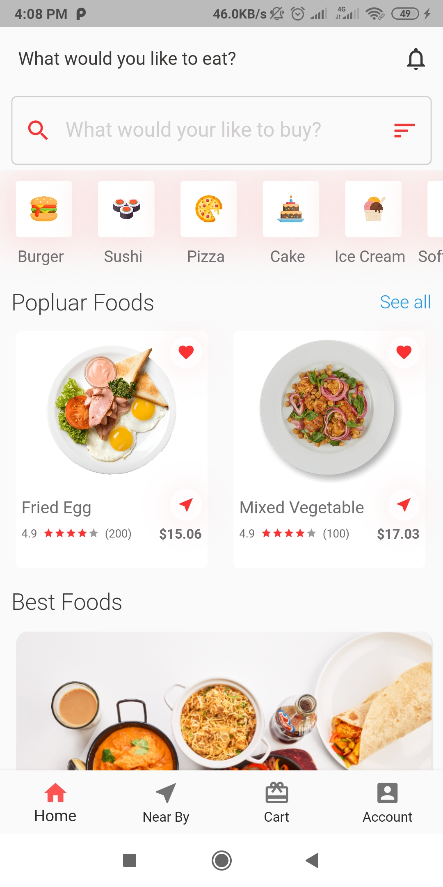
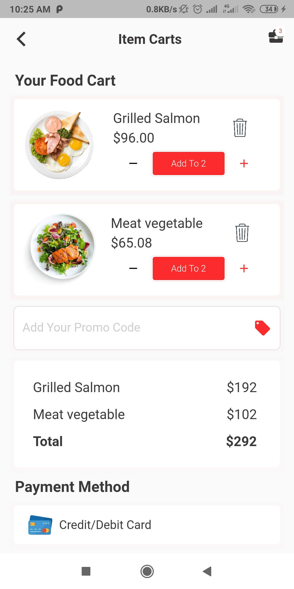

# Flutter Food Delivery Application Design

## This application is not completed yet. Currently, I am working on it. 
A small attempt to make an Food delivery app user interface in Flutter for Android and iOS.

## Food Ordering & Delivery App UI in Flutter

## ScreenShots
### Home Page

### Food Details Screen & Add To Cart Screen
 &nbsp;&nbsp;&nbsp;&nbsp; 

### Login & Registration Screen
&nbsp;&nbsp;&nbsp;&nbsp; 

## ✨ Requirements
* Any Operating System (ie. MacOS X, Linux, Windows)
* Any IDE with Flutter SDK installed (ie.  Android Studio, VSCode, IntelliJ, etc)
* A little knowledge of Dart and Flutter
* A brain to think 🤓🤓

